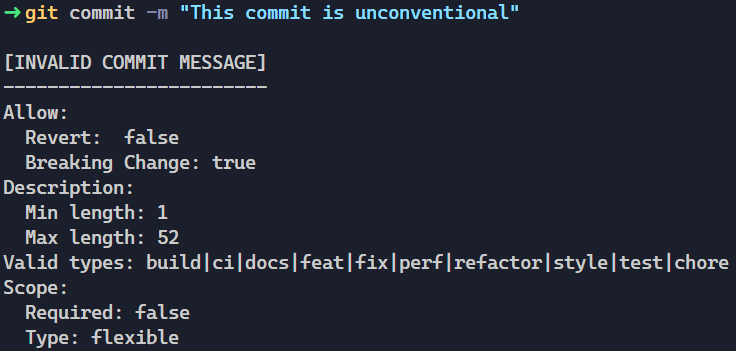

# Conventional commits with git hooks

This git hook provides a customazible way to check and enforce a convention for git commits. [This commits convention](https://www.conventionalcommits.org/en/v1.0.0/) proposes a format like this:
```
<type>[optional scope]: <description>
```
But this is somewhat rigid and not in phase with our workflow. This commit hook offers a config file to make it more flexible.

# Usage
Commit as usual, if your commit don't follow the config rules, it will be aborted with a error message.


> In case of ultra-mega important commit, that you need to push NOW, you can bypass the hook with `git commit --no-verify -m "THE APP IS WORKING AGAIN!!!"`.

# Default type
The default types used in the templates are from the [angular commit messages guidelines](https://github.com/angular/angular/blob/22b96b9/CONTRIBUTING.md#type):
- build: Changes that affect the build system or external dependencies (example scopes: gulp, broccoli, npm)
- ci: Changes to our CI configuration files and scripts (example scopes: Travis, Circle, BrowserStack, SauceLabs)
- docs: Documentation only changes
- feat: A new feature
- fix: A bug fix
- perf: A code change that improves performance
- refactor: A code change that neither fixes a bug nor adds a feature
- style: Changes that do not affect the meaning of the code (white-space, formatting, missing semi-colons, etc)
- test: Adding missing tests or correcting existing tests

# Settings
This full example will help understand the table:
```
revert: type(scope)!: description
```

| Setting               | Value          | Explanations                                                                             |
| --------------------- | -------------- | ---------------------------------------------------------------------------------------- |
| enabled               | `boolean`      | enable or disable the hook                                                               |
| debug                 | `boolean`      | enable [debug mode](#debug)                                                              |
| allow.revert          | `boolean`      | allow to optionnaly prefix the commit with `revert: `                                    |
| allow.breakingChange  | `boolean`      | allow to optionnaly add a `!` to specify a breaking change                               |
| descriptionLength.min | `int`          | minimum length of the commit description                                                 |
| descriptionLength.max | `int`          | maximum length of the commit description                                                 |
| types                 | `list<string>` | list of usable values for the `type` field                                               |
| scope.required        | `boolean`      | define if the `scope` field is mandatory                                                 |
| scope.type            | `string`       | define what we can put in the `scope` field, can be `value`, `projectItem` or `flexible` |
| scope.values          | `list<string>` | list of usable values for the `scope` field, only necessary if `scope.type == value`     |

## `scope.type`
- `value` -> behave like the `types` field: will onty accept the values in the `scope.values` list
- `projectItem` -> will only accepts project item ids: `#13`, `#3572`, `#6218`, ...
- `flexible` -> will accepts anything except empty

# Install
Copy the `.githooks/commit-msg` file to your project folder. Copy the `templates/kuhn.config.json` file to the root of your project and rename it `commit.config.json`.

> The other templates are examples using conventions other than the one used within Kuhn.

**Each developper** will need to change one git setting:
```bash
$ git config core.hooksPath .githooks
```

If the hook is already present in the project, just change the git setting.

# Debug
If you run into a problem, you can change the `debug` option to `true`, the hook will output the regex generated from the config file.
Copy the regex to [regex101](https://regex101.com/r/opvFS3/1) and test it against the examples.
